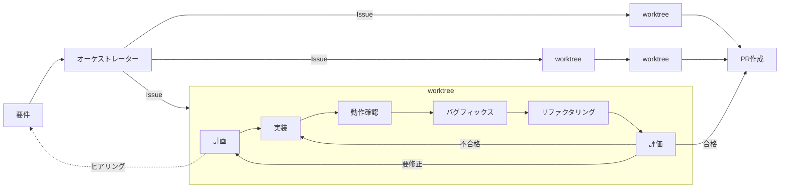

## はじめに

エージェントやハーネス、ループ…。最近の生成AI界隈は、トレンドの移り変わりが早すぎて、正直ついていくだけで一苦労です。気づけば新しい概念が増えていて、最新の技術に取り残されつつある。そんな人も少なくないのではないでしょうか？

そこで、誰でも・今すぐ・簡単に使えるように作ったのが「[Trinity](https://github.com/yjn279/trinity)」です。インストールすればすぐに動き、面倒な設定は要りません。ただでさえ覚えることの多い時代なので、できるだけ認知負荷を増やさないシンプルな設計にしました🐎

中身は、Anthropic の [Harness design for long-running application development](https://www.anthropic.com/engineering/harness-design-long-running-apps) で紹介された Planner / Generator / Evaluator のサイクルをベースにしています。計画する人・実装する人・評価する人の3役が、人間の代わりにレビューと差し戻しをぐるぐる回してくれる、という仕組みです。

## 使ってみる

四の五の言う前に、まず動かしてみましょう。Claude Code で以下を実行するだけで使えます。

```plaintext
/plugin marketplace add yjn279/trinity
/plugin install trinity@yjn279
```

インストールするだけで、設定なしですぐに使えます。あとは要件を自然文で投げるだけです。

```plaintext
/trinity:run ユーザー設定ページにテーマトグルを追加する。
```

複数の Issue をまとめて渡すこともできます。その場合は依存関係を踏まえつつ、独立した環境で並列に実装を進めます。

```plaintext
/trinity:run #12 #15 #20
```

ふつうに Claude Code を使うより、時間もコストもかかります。でもその代わり、こちらが逐一確認しなくても、長時間ずっと高い品質で走り続けてくれる。画面に張り付くのをやめて席を立てる、というのが Trinity の狙いです。

## ハーネス設計

Trinity は、役割ごとに振る舞いを指示したエージェントと、その処理をバックグラウンドで回すシェル、そして要件を解釈して作業を割り当てるオーケストレーターでできています。まるごとプラグインとして配布されるので、インストールすればそのまま動きます。

肝心のエージェントは、Planner・Generator・Evaluator の3役に分かれています。オーケストレーターが要件を作業単位（Issue）に切り分け、各 Issue を隔離した worktree の中で次のループに回します。Evaluator が合格を出すまでループは自動で回り続け、人間の出番は方針を決める最初の一瞬だけです。



各エージェントの役割を以下に示します。

| エージェント | モデル | 役割 |
| :-- | :-- | :-- |
| Planner | opus | 受け入れ基準つきの計画をつくる |
| Generator | sonnet | worktree の中で実装し、1コミットする |
| Evaluator | sonnet | コミットを独立に評価し、判定を返す |

では、わざわざ3つに分ける理由はどこにあるのか。計画・実装・評価を1つの頭に詰め込むと、文脈が膨らむほど判断がぶれて、評価者が自分の書いたコードを甘く見はじめます。自分の答案を自分で採点したら甘くなるのは、人間でも同じですよね。

Trinity はここを設計で潰しています。3役はそれぞれ独立したプロセスで動くので、Evaluator は Generator の思考を覗けません。読めるのは計画書や Git の情報だけで、カンニングしたくてもできない構造です。さらに、動作確認・バグフィックス・リファクタリングは毎回かならず走るようになっていて、Evaluator はその結果をふまえ、機械的には下せない判断に集中します。評価が通るまで、計画と実装の修正が繰り返されます。

## 何が優れているのか？

長時間タスクを AI に任せる道は、Trinity のほかにもあります。まずは代表的な3つを挙げます。

1. 自作ハーネス：ゼロから自分で組みます。最も自由ですが、役割分割も隔離も再開処理も全部自前で、いちばん骨が折れます。
2. Workflows：Claude Code 組み込みの機能です。エージェントがワークフローを動的に組むので指示は要りませんが、実行のたびにフローが変わるため、挙動が安定しません。保存もできますが、それなら最初から Trinity を使えばいい、という話です。
3. TAKT（[nrslib/takt](https://github.com/nrslib/takt)）：ワークフローを YAML で定義して複数エージェントを指揮する、Trinity のインスピレーション元です。カスタマイズできる反面、その設計を書くハードルが高く、しかも一度組んだワークフローは固定的で、実行時の柔軟性に欠けます。

以下に、3つと Trinity の特徴をひとことでまとめます。

| 比較対象 | 特徴 |
| :-- | :-- |
| 自作ハーネス | 自分で設計する必要がある。 |
| Workflows | エージェントが動的生成するため、揺れが生じる。 |
| TAKT | カスタマイズ性がある反面、ややハードルは高い。 |
| Trinity | シンプルな1つのワークフローなので、簡単に利用できる。 |

要するに、いちばん手軽に始められるのが Trinity です。柔軟性はオーケストレーターが吸収してくれるので、こちらは設定ゼロのまま任せられます。

## おわりに

Trinity を開発するにあたり、細かい UX には特にこだわりました。

Trinity では、worktree による隔離環境の構築やブランチ運用、自動 PR 作成やクリーンアップまで、実装前後の面倒なところもすべてルーティンワークとしてこなしてくれます。このルーティンワークは [Git-Flow Skill](https://github.com/yjn279/.claude/tree/main/skills/git-flow) という単体スキルにも切り出しているので、こちらもぜひ使ってみてください😉

もう一つこだわった点が、Issue の起票提案です。Trinity が作業中に見つけた対象リポジトリの改善ネタや、Trinity 自体の改善ネタを提案してくれます。選択するだけですぐに Issue 化できるので、Trinity を回すだけでどんどん改善が進んでいきます。

ハーネスを利用する最初の一歩に、ぜひ Trinity を使ってみてはいかがですか？

## 参考

- [yjn279/trinity: Harness for long-running tasks.](https://github.com/yjn279/trinity)
- [Harness design for long-running application development \ Anthropic](https://www.anthropic.com/engineering/harness-design-long-running-apps)
- [AIの見張り番をやめよう - AIチームを指揮するOSS「TAKT」を公開しました](https://zenn.dev/nrs/articles/c6842288a526d7)
