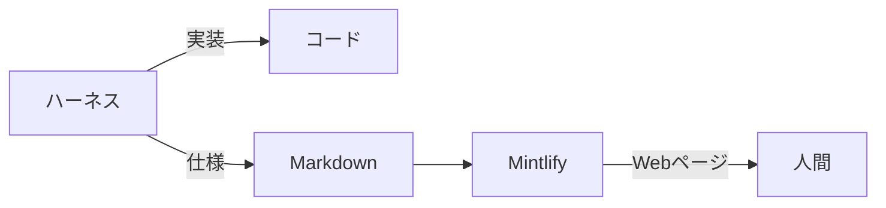

:::message
この記事は、社内の共有会で発表した内容を雑にまとめたものです。
:::

## はじめに

ハーネスを組むようになってから、Pull Request の差分を 1 行ずつ追う機会がめっきり減りました。

計画して、実装して、評価する。この一周を AI が勝手に回してくれるので、細かい実装の妥当性はそちらに任せておけば大体なんとかなります。人間が差分を舐めるように読む意味は、正直かなり薄くなってきました[^1]。

代わりに困るようになったのが、「で、結局どういう仕様になったんだっけ？」です。差分をいくら眺めても、そこから仕様は立ち上がってきません。分かるのは変えた場所だけで、いまどうなっているかは分からないんですよね。

だったら仕様はドキュメントで読めばいい。そう思って AI にドキュメントを書かせてみたのですが、今度は白黒の Markdown ファイルがずらっと並ぶだけで、まったく読む気が起きませんでした。中身がどうこう以前の問題です。

そこで見つけたのが、その Markdown を整った Web ページとして表示してくれる [Mintlify](https://mintlify.com) というサービスです 📚

## 結論

レビューで差分を追うのをやめて、仕様は Mintlify に表示させたドキュメントで把握する。これだけです。

コードと仕様を書くのは AI、見た目を与えるのは道具、仕様を読むのは人間。この役割分担がすべてです。

## Mintlify とは：ドキュメントをコードとして扱う

Mintlify は、ドキュメントを Markdown のままリポジトリで管理して、そのまま Web サイトとして公開してくれるサービスです。公式サイトではこれを docs-as-code、つまりドキュメントをコードとして扱う考え方だと説明しています[^2]。

実際に Mintlify 自身のドキュメントもこの方式で作られていて、リポジトリを開くと Markdown がフォルダごとに並んでいるだけです。

*mintlify/docs より引用 [^3]*

表示の設定も同じリポジトリの中に置きます。`docs.json` に色やナビゲーションを書いておくと、それがそのままサイトの見た目になります。

*mintlify/docs より引用 [^3]*

つまり、ドキュメントの中身も見た目も Git の管理下に入ります。ブランチを切って直して、push すれば公開される。コードとまったく同じ道具立てで扱えるのが、この方式のいいところですね。

## 素の Markdown と、表示された Markdown

では、実際にどのくらい変わるのか。同じ 1 ファイルで見比べてみます。

まずは、リポジトリに置かれている素の Markdown です。

*mintlify/docs より引用 [^3]*

そしてこちらが、同じファイルを Mintlify が表示したページです。

*Mintlify Documentation より引用 [^2]*

中身は 1 文字も変わっていません。それでも、左に目次があって、見出しが階層で見えて、補足がボックスで浮いているだけで、読み始めるまでの心理的なハードルがまるで違うんですよね。

後回しにしていたドキュメントを、気づけば普通に開くようになっていました。

## なぜ HTML ではなく Markdown なのか

ここが今回いちばん言いたいところです。

最近は、AI に直接 HTML を出力させてドキュメントを作る、という話もよく聞きます。見た目まで一気に仕上がるので魅力的に見えますが、個人的にはあまりおすすめしません。

まず、生成のたびにデザインが変わってしまいます。AI が毎回違うレイアウトを吐き出すので、読む側は内容に入る前に、まず今回のレイアウトを読み解くところから始めることになります。仕様を知りたいだけなのに、いつまで経っても慣れません。

もう一つ、タグの分だけ入力も出力も長くなり、トークンを余計に消費します。`
` や `` を書かせるだけで文字数が膨らんでいくので、ちりも積もればで意外とばかになりません。

一方 Markdown であれば、AI が触るのは文章の構造だけで済みます。見た目は Mintlify 側が常に同じ形で与えてくれるので、デザインは毎回変わりません。

| 生成させるもの | デザイン | トークン | 読む側 |
| :-- | :-- | :-- | :-- |
| HTML | 毎回変わる | タグの分だけ増える | レイアウトの読み解きから始まる |
| Markdown | 道具が与えるので一定 | 構造だけなので増えない | 仕様だけを読めばよい |

デザインが一定であれば、どこに何が書いてあるかを探し直す必要がありません。前回読んだページと同じ場所に、同じように情報が並んでいます。この安心感は、思っている以上に大きいです。

要するに、この役割分担さえ成り立てば、道具は Mintlify でなくてもいいはずです。**AI は構造だけを書き、見た目は道具に任せる**。この線引きこそが、仕様を追う負荷をだいぶ軽くしてくれます。

## 仕様の追い方がどう変わったか

いまは、実装と一緒にドキュメントも更新させておいて、人間はそのドキュメントだけを読むようにしています。差分は ~~見ない~~ 必要になったときだけ見ます。

有料プランでは、ブランチごとにドキュメントのプレビューを作れます。Pull Request を出すタイミングでドキュメントも更新されていれば、そのブランチのプレビューを開くだけで、いまの仕様がひととおり分かるという仕組みです。

無料プランでも、ローカルでプレビューを起動することはできます。同じ Wi-Fi につながっていれば、パソコンで動かしたプレビューをスマホから見に行くこともできて、ちょっとした確認には十分です。パソコンの前に戻らなくても仕様を確かめられるのは、地味にありがたいポイントですね。

ブランチごとのプレビューはあくまで有料プランの機能なので、チーム全体で乗り換えるのはもう少し先になりそうです。とはいえ、選択肢のひとつとして持っておく価値はあると思っています。

## おわりに

だいぶ地味な話ですが、レビューをやめた先に何を読むのかという問題は根が深いので、文章にしてみました。

発表のあとの雑談では、参加者から「見やすくすることも大事だけど、それ以上にドキュメントを最新に保つ仕組みのほうが大事ですよね」という指摘をもらいました。まったくその通りだと思います。見た目を整えても、中身が古ければ仕様として読む意味がありません。

ドキュメントを CI/CD で常に最新化する仕組みがあってはじめて、Mintlify による見やすさが生きてきます。見た目を整える工夫は今日からでも始められますが、更新し続ける仕組みのほうはもう少し地道な積み重ねが要りますね。

読みやすさと最新さ、この両方が揃ったときに、差分を追わない開発はようやく完成するのだと思います。ぜひ、手元のリポジトリで一度動かしてみてはいかがですか？😉

## 参考

- [Mintlify](https://mintlify.com)
- [Mintlify Documentation](https://mintlify.com/docs)
- [mintlify/docs: Official Mintlify documentation](https://github.com/mintlify/docs)

[^1]: [yjn279/trinity: Harness for long-running tasks.](https://github.com/yjn279/trinity)
[^2]: [Quickstart | Mintlify](https://mintlify.com/docs/quickstart)
[^3]: [mintlify/docs](https://github.com/mintlify/docs)
