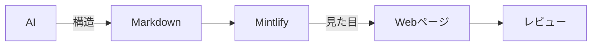
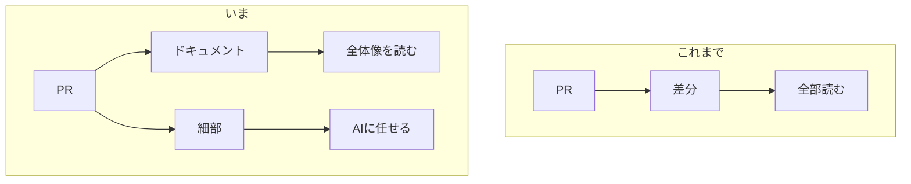

:::message
この記事は、社内の共有会で発表した内容を雑にまとめたものです。
:::

## はじめに

AI にコードを書かせるようになり、最近は仕様書まで任せるようになりました。

便利になった一方で、レビューがまったく追いついていません。Pull Request が何件も並んでいるのを見ると、正直、もう見ていられないんですよね。差分を開くたびに、どこから手をつけたものかと悩む時間のほうが長い気がします。

輪をかけて厄介なのが、AI が吐き出す Markdown ファイルそのものです。白黒のファイルがずらっと並んでいるだけだと目が滑ってしまって、なかなか開く気になりません。中身がどうこう以前の問題ですね。

そこで見つけたのが、Markdown を整った Web ページとして表示してくれる [Mintlify](https://mintlify.com) というサービスです 📚

## 結論

Markdown は Mintlify に表示させて、Pull Request の差分ではなくドキュメントを読む。これだけです。

構造を書くのは AI、見た目を与えるのは道具、読むのは人間。この役割分担がすべてです。

## Mintlify を入れると何が変わるか

Mintlify は、もともとドキュメントサイトを自動で作るためのサービスです。Markdown で書いたファイルを渡すだけで、そのまま整った Web ページとして表示してくれます。

*Mintlify 公式サイトより引用 [^1]*

ドキュメント用のフォルダに Markdown を並べておくだけで、見出しもコードブロックもきれいにレイアウトされた状態で出てきます。導入の手間はほとんどありません。

これが思いのほか効きます。エディタでファイル名がずらっと並んでいるのを見るのと、上のようなページとして表示されるのとでは、読み始めるまでの心理的なハードルがまるで違うんですよね。

中身は 1 文字も変えていないのに、開く気になるかどうかがはっきり変わってきます。後回しにしていたドキュメントを、気づけば普通に開くようになっていました。

## なぜ HTML ではなく Markdown なのか

ここが今回いちばん言いたいところです。

最近は、AI に直接 HTML を出力させてドキュメントを作る、という話もよく聞きます。見た目まで一気に仕上がるので魅力的に見えますが、個人的にはあまりおすすめしません。

まず、生成のたびにデザインが変わってしまいます。AI が毎回違うレイアウトを吐き出すので、読む側は内容に入る前に、まず今回のレイアウトを読み解くところから始めることになります。見出しの付け方も強調の仕方もそのつど違うので、いつまで経っても慣れません。

もう一つ、タグの分だけ入力も出力も長くなり、トークンを余計に消費します。`
` や `` を書かせるだけで文字数が膨らんでいくので、ちりも積もればで意外とばかになりません。

一方 Markdown であれば、AI が触るのは文章の構造だけで済みます。見た目は Mintlify 側が常に同じ形で与えてくれるので、デザインは毎回変わりません。

| 生成させるもの | デザイン | トークン | 読む側 |
| :-- | :-- | :-- | :-- |
| HTML | 毎回変わる | タグの分だけ増える | レイアウトの読み解きから始まる |
| Markdown | 道具が与えるので一定 | 構造だけなので増えない | 内容だけを読めばよい |

デザインが一定であれば、どこに何が書いてあるかを探し直す必要がありません。前回読んだページと同じ場所に、同じように情報が並んでいます。この安心感は、思っている以上に大きいです。

要するに、この役割分担さえ成り立てば、道具は Mintlify でなくてもいいはずです。**AI は構造だけを書き、見た目は道具に任せる**。この線引きこそが、レビューの負荷をだいぶ軽くしてくれます。

## レビューの流れがどう変わったか

実際に、レビューのやり方そのものも変えました。Pull Request の差分を 1 行ずつ追いかける代わりに、ドキュメントを主軸に置くようにしています。

大事なところはドキュメントを読んで押さえ、細かい実装の妥当性は AI に ~~丸投げ~~ お任せしています。全部を自分の目で追う体力は、さすがに残っていません。

有料プランでは、ブランチごとにドキュメントのプレビューを作れます。Pull Request を出すタイミングでドキュメントも一緒に更新しておけば、そのブランチのプレビューを開くだけで変更の全体像がつかめる、という仕組みです。コードの差分を延々と読むより、まとまった説明を 1 つ読むほうがずっと速いですね。

無料プランでも、ローカルでプレビューを起動することはできます。同じ Wi-Fi につながっていれば、パソコンで動かしたプレビューをスマホから見に行くこともできて、ちょっとした確認には十分です。パソコンの前に戻らなくても様子を見に行けるのは、地味にありがたいポイントです。

ブランチごとのプレビューはあくまで有料プランの機能なので、チーム全体で乗り換えるのはもう少し先になりそうです。とはいえ、選択肢のひとつとして持っておく価値はあると思っています。

## おわりに

だいぶ地味な話ですが、レビューが回らないという悩みは根が深いので、文章にしてみました。

発表のあとの雑談では、参加者から「見やすくすることも大事だけど、それ以上にドキュメントを最新に保つ仕組みのほうが大事ですよね」という指摘をもらいました。まったくその通りだと思います。見た目を整えても、中身が古ければ意味がありません。

ドキュメントを CI/CD で常に最新化する仕組みがあってはじめて、Mintlify による見やすさが生きてきます。見た目を整える工夫は今日からでも始められますが、更新し続ける仕組みのほうはもう少し地道な積み重ねが要りますね。

読みやすさと最新さ、この両方が揃ったときに、ドキュメントを主軸にしたレビューはようやく完成するのだと思います。ぜひ、手元のリポジトリで一度動かしてみてはいかがですか？😉

## 参考

- [Mintlify](https://mintlify.com)
- [Mintlify Documentation](https://mintlify.com/docs)

[^1]: [Mintlify](https://mintlify.com)
