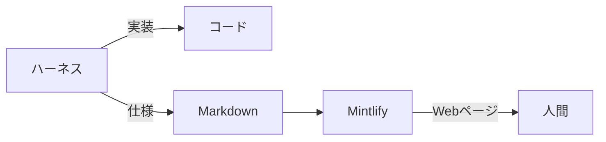

:::message
この記事は、社内の共有会で発表した内容を雑にまとめたものです。
:::

## はじめに

ハーネスを組むようになってから、Pull Request の差分を 1 行ずつ追う機会がめっきり減りました。計画して、実装して、評価する。この一周を AI が回してくれるので、細かい妥当性はそちらに任せておけば大体なんとかなります[^1]。

代わりに困るのが「で、結局どういう仕様になったんだっけ？」です。差分をいくら眺めても、そこから仕様は立ち上がってきません。ドキュメントを読めばいいのですが、AI に書かせると白黒の Markdown が並ぶだけで読む気が起きないんですよね。そこで見つけたのが [Mintlify](https://mintlify.com) です 📚

## 結論

差分を追うのをやめて、仕様は Mintlify に表示させたドキュメントで把握する。これだけです。

書くのは AI、見せるのは道具、読むのは人間。この役割分担がすべてです。

## Mintlify とは：ドキュメントをコードとして扱う

Mintlify は、ドキュメントを Markdown のままリポジトリで管理して、そのまま Web サイトとして公開してくれるサービスです。公式サイトではこれを docs-as-code、つまりドキュメントをコードとして扱う考え方だと説明しています[^2]。

実際に Mintlify 自身のドキュメントもこの方式で作られていて、リポジトリを開くと Markdown がフォルダごとに並んでいるだけです。

*mintlify/docs より引用 [^3]*

表示の設定も同じリポジトリの中に置きます。`docs.json` に色やナビゲーションを書いておくと、それがそのままサイトの見た目になります。

*mintlify/docs より引用 [^3]*

つまり、ドキュメントの中身も見た目も Git の管理下に入ります。ブランチを切って直して、push すれば公開される。コードとまったく同じ道具立てで扱えるのが、この方式のいいところですね。

## 素の Markdown と、表示された Markdown

では、実際にどのくらい変わるのか。同じ 1 ファイルで見比べてみます。

まずは、リポジトリに置かれている素の Markdown です。

*mintlify/docs より引用 [^3]*

そしてこちらが、同じファイルを Mintlify が表示したページです。

*Mintlify Documentation より引用 [^2]*

中身は 1 文字も変わっていません。それでも、左に目次があって、見出しが階層で見えて、補足がボックスで浮いているだけで、読み始めるまでの心理的なハードルがまるで違うんですよね。

後回しにしていたドキュメントを、気づけば普通に開くようになっていました。

## なぜ HTML ではなく Markdown なのか

ここが今回いちばん言いたいところです。最近は AI に直接 HTML を出力させる話もよく聞きますが、個人的にはあまりおすすめしません。

生成のたびにデザインが変わるので、読む側は仕様を知りたいだけなのに、まず今回のレイアウトを読み解くところから始めることになります。おまけにタグの分だけ入力も出力も長くなり、トークンを余計に消費します。

| 生成させるもの | デザイン | トークン | 読む側 |
| :-- | :-- | :-- | :-- |
| HTML | 毎回変わる | タグの分だけ増える | レイアウトの読み解きから始まる |
| Markdown | 道具が与えるので一定 | 構造だけなので増えない | 仕様だけを読めばよい |

デザインが一定であれば、どこに何が書いてあるかを探し直す必要がありません。**AI は構造だけを書き、見た目は道具に任せる**。この線引きさえ成り立てば、道具は Mintlify でなくてもいいはずです。

## 仕様の追い方がどう変わったか

いまは実装と一緒にドキュメントも更新させておいて、人間はそのドキュメントだけを読んでいます。差分は ~~見ない~~ 必要になったときだけ見ます。

有料プランではブランチごとにプレビューを作れるので、Pull Request を開かなくても、そのブランチの仕様がひととおり分かります。無料プランでもローカルでプレビューを起動でき、同じ Wi-Fi ならスマホから見に行けるのは地味にありがたいポイントですね。

## おわりに

発表のあとの雑談では、参加者から「見やすさよりも、ドキュメントを最新に保つ仕組みのほうが大事ですよね」という指摘をもらいました。まったくその通りで、中身が古ければ仕様として読む意味がありません。

読みやすさと最新さ。この両方が揃ったときに、差分を追わない開発はようやく完成するのだと思います😉

## 参考

- [Mintlify](https://mintlify.com)
- [Mintlify Documentation](https://mintlify.com/docs)
- [mintlify/docs: Official Mintlify documentation](https://github.com/mintlify/docs)

[^1]: [yjn279/trinity: Harness for long-running tasks.](https://github.com/yjn279/trinity)
[^2]: [Quickstart | Mintlify](https://mintlify.com/docs/quickstart)
[^3]: [mintlify/docs](https://github.com/mintlify/docs)
