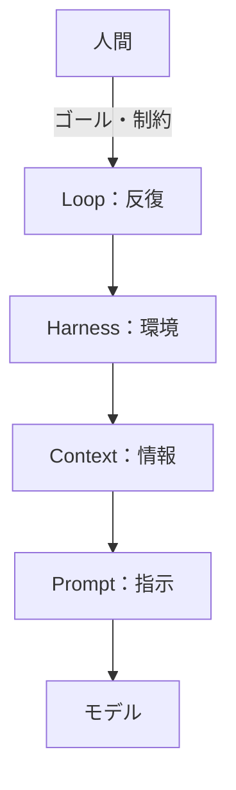
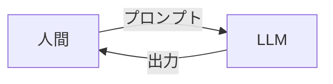
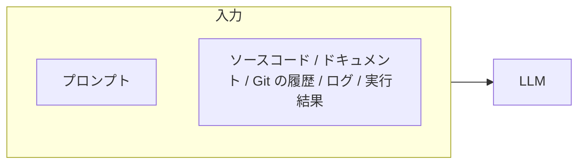
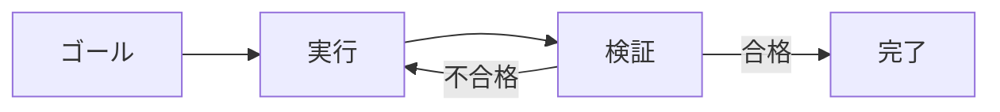
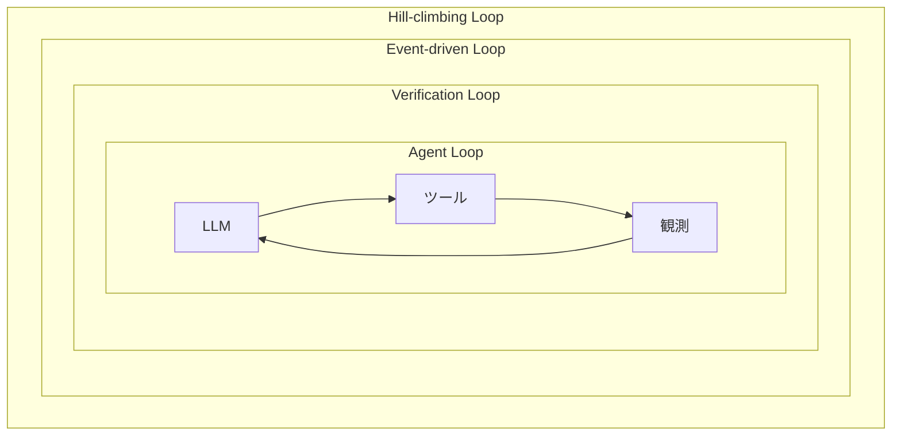

## はじめに

Prompt、Context、Harness、Loop。この1年で、生成AI界隈の「〜エンジニアリング」はずいぶん増えました。名前だけを見ていると、流行り言葉が積み上がっているようにしか見えないんですよね。

ただ、この順番に並べ直すと1本の線が通っていることに気づきます。設計する対象が、AIへの「指示」から、AIが「仕事を最後まで終わらせる仕組み」へと、**一段ずつ外側に広がってきただけ**です。

| 段階 | 設計するもの | 問い |
| :-- | :-- | :-- |
| Prompt | 指示 | 何をしてほしい？ |
| Context | 情報 | 何を知る必要がある？ |
| Harness | 環境 | 何を使って仕事する？ |
| Loop | 反復 | どう完了させる？ |

図にすると、外側の段階が内側の段階を丸ごと抱える形になります。新しい段階が古い段階を置き換えた訳ではなく、外に一枚ずつ足されていった、というのが正確なところです。

:::message
この4段階は公式な標準分類ではありません。設計の対象がどう広がってきたかを捉えるための概念モデルとして整理しています。
:::

という訳で、4つの段階を順に追いながら、いまは何を設計する時代になったのかを確かめていきます🔁

## Prompt Engineering

まずは指示の設計です。人間がプロンプトを書き、モデルが出力を返す。それだけです。

書く中身は、ゴール・手順・制約・例のおおむね4つに落ち着きます。この4つを言葉にすると出力が安定する、というのがプロンプトエンジニアリングの正体でした。

モデルが賢くなるにつれ、この段階の話題は下火になりました。とはいえ、頭の中にある暗黙の前提までは、いまだにモデルから見えません。要求を言語化する作業そのものは、呼び名が変わっても残り続けます。

問いは「何をしてほしい？」です。

https://zenn.dev/activecore/articles/019-oreore-prompt-tips

## Context Engineering

次は情報の設計です。同じ指示を出しても、モデルが何を見ているかで結果はまるで変わります。

ここで大切なのは、大量に渡すことではありません。必要な情報を、必要なタイミングで渡すことです。関係のない情報が混ざるほど精度は落ち、トークンも余計にかかります。多ければ多いほど良い、という話ではないんですよね。

要するに、AIに読ませるのは必要最低限かつ本質的な情報だけにしたい訳です。

問いは「何を知る必要がある？」に変わります。

## Harness Engineering

3つめは環境の設計です。ハーネスとは、モデルの周りに置く足場・制約・フィードバックの総体を指します[^1]。リポジトリの構造、CI の設定、フォーマッタ、パッケージマネージャ、プロジェクトの指示書。これらは全部ハーネスです。

代表的な構成要素と、その役割を以下に示します。

| 構成要素 | 役割 |
| :-- | :-- |
| ツール | 外の世界へ手を伸ばす |
| 記憶・状態 | セッションをまたいで文脈を保つ |
| スキル | プロジェクト固有の知識を渡す |
| サンドボックス | 失敗しても被害の出ない場所を用意する |
| 権限 | やってよいことの範囲を決める |
| テスト | 出来を機械的に判定する |
| 観測 | 何をしたのかを後から追えるようにする |
| 復帰 | 詰まったときに立て直す |

エージェントは、この環境の中でモデルを呼びます。裏返すと、モデルがどれだけ賢くても、テストのないリポジトリでは品質を自分で確かめられず、権限のない場所ではそもそも手が出せません。

OpenAI は、この環境づくりだけで5ヶ月・約100万行のコードを書き、1,500件の Pull Request をマージしたと報告しています。人間が書いた行は1行もないそうです。にわかには信じがたい数字ですね。エンジニアの仕事は、実装から「環境を設計し、意図を伝え、構造化されたフィードバックを返すこと」へ移った、と述べられています[^1]。

問いは「何を使って、どんな環境で仕事する？」です。

## Loop Engineering

最後が反復の設計です。ハーネスまで整えても、人間が「次はこれをやって」「エラーを直して」「もう一度テストして」と言い続けているうちは、結局こちらが画面に張り付くことになります。

そこで、ゴールと制約だけを渡し、完了までの往復はまるごと任せます。

この転換は、以下の一文がいちばん端的だと思います[^2]。

> You shouldn't be prompting coding agents anymore. You should be designing loops that prompt your agents.

エージェントにプロンプトを打つのをやめて、エージェントにプロンプトを打つループを設計する。設計の対象が、ひとつ外側にずれた訳です。

問いは「どう自律的に仕事を完了させる？」になります。

## 4つのループ

ループと一口に言っても、粒度はいろいろです。LangChain は、これを4段階に整理しています[^3]。

| ループ | 回すもの | ひとことで |
| :-- | :-- | :-- |
| Agent Loop | LLM → ツール → 観測 | 仕事をする |
| Verification Loop | 結果 → 評価 → 差し戻し | 正しいか確認する |
| Event-driven Loop | Issue・CI・Webhook・Cron | 仕事を自動的に始める |
| Hill-climbing Loop | 実行履歴 → 分析 → 改善 | 仕組みを改善する |

では、この4つは横並びの選択肢なのか。そうではなく、内側のループを外側のループが包む入れ子の関係にあります。外側が回るほど内側が賢くなる、という向きです。

いちばん内側の Agent Loop は、モデルがツールを呼び、その結果を見て次の一手を決める往復です。Codex も Claude Code も、中心にあるのはこの単純な繰り返しでしかありません[^4]。

その外側の Verification Loop は、出てきた結果を別の目で採点し、落ちたら差し戻す仕組みです。Anthropic のハーネス設計では、実装する Generator と評価する Evaluator を別のエージェントに分けています。同じ頭に採点までやらせると、自分の書いたコードを自信たっぷりに褒め始めるからです[^5]。この分割は、私が作ったハーネスでもそのまま採用しています。

https://zenn.dev/activecore/articles/021_trinity-harness-for-long-running-tasks

さらに外側の Event-driven Loop は、仕事の始まりそのものを自動化します。OpenAI が公開した Symphony は、Linear のような課題管理ツールを制御盤にして、エージェントに作業を拾わせ、隔離した作業場で実行し、CI を見て Pull Request まで用意させる仕様です。止まったエージェントの再起動まで面倒を見ます[^6]。人間が起点になる必要は、もうどこにもない訳です。

いちばん外側の Hill-climbing Loop だけは、毛色が違います。ここで改善するのは成果物ではなく、エージェントの仕組みそのものです。実行の記録を分析し、Prompt・Context・Harness を書き換えて、内側のループの質を上げる。つまり、この記事でここまで見てきた3段階が、まるごと改善の対象になります。

## 人間はどこに残るのか

ループが外へ広がるほど、人間の居場所も外へ押し出されます。Addy Osmani は、調査・実装・検証を回すエージェント側を inner loop、出すか止めるかを決める人間側を outer loop と呼び、後者だけは手放すなと言っています[^7]。

> The agent can ship more than you can review.

生成ではなく検証がボトルネックになる、という指摘です[^8]。人間のレビューを完全に外した工場は、最初こそ速く見えるものの、誰も中身を理解していないコードが溜まっていきます。

実際、コーディングエージェントを長い開発サイクルで評価した LoopsBench では、8言語・9ドメインにまたがる112タスクのうち、最も強い構成でも完走できたのは25%でした。作業の依存関係を見失うことと、一度直した箇所がまた壊れることが、主な原因として挙げられています[^9]。

ループは、まだ勝手に完走してくれる段階にはありません。だからこそ、最初にゴールと制約を決めるところと、最後に出すか止めるかを決めるところは、当分こちら側の仕事として残ります。

## おわりに

正直、解説することはあまりないのですが、新しい「〜エンジニアリング」が出てくるたびに疲れていたので、一度並べて整理してみました。

こうして見ると、やっていることは一貫していました。指示を設計し、情報を設計し、環境を設計し、反復を設計する。設計の対象が、外側へ一段ずつ広がってきただけです。

次に新しい名前が出てきたときも、たぶんこの外側のどこかに置かれるのだと思います。そのときに慌てないためにも、いま自分のループがどこまで回っているのか、ぜひ一度確かめてみてはいかがですか？

[^1]: [Harness engineering: leveraging Codex in an agent-first world | OpenAI](https://openai.com/index/harness-engineering/)
[^2]: [Loop Engineering | Addy Osmani](https://addyosmani.com/blog/loop-engineering/)
[^3]: [The Art of Loop Engineering | LangChain](https://www.langchain.com/blog/the-art-of-loop-engineering)
[^4]: [Unrolling the Codex agent loop | OpenAI](https://openai.com/index/unrolling-the-codex-agent-loop/)
[^5]: [Harness design for long-running application development | Anthropic](https://www.anthropic.com/engineering/harness-design-long-running-apps)
[^6]: [An open-source spec for Codex orchestration: Symphony. | OpenAI](https://openai.com/index/open-source-codex-orchestration-symphony/)
[^7]: [Own the Outer Loop | Addy Osmani](https://addyosmani.com/blog/own-the-outer-loop/)
[^8]: [Software Factories | Addy Osmani](https://addyosmani.com/blog/software-factories/)
[^9]: [LoopsBench: From Harness Engineering to Loop Engineering in Coding Agent Evaluation | arXiv](https://arxiv.org/abs/2608.00267)
