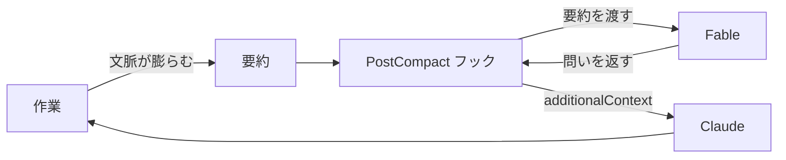

## はじめに

~~Twitter~~ X で一時期話題になっていた、 Fable にアドバイザーとして振る舞ってもらう記事をふと思い出し、よきタイミングで相談させるためのフックを実装することにしました。

お気づきの方も多いと思いますが、作成後にほぼ同じ機能の advisor ツールなるものが Claude Code に標準搭載されていることを知り[^1]、無事に車輪を再発明することに成功したので、ここで成仏させることにします 🪦

## advisor とは

Claude Code に標準搭載されている、エージェントが上位モデルにアドバイスを求めることができるようになる機能です。

設定も簡単で、スラッシュコマンド1つで機能をオンにできます。

```
/advisor fable
```

## 再発明した Hook について

会話が要約された直後に発火するフックです。Claude Code には、そのタイミングで呼び出せる `PostCompact` というフックがちょうど用意されていました。

受け取った要約を Fable に読ませ、返ってきた問いを `additionalContext` として Claude の文脈へ渡します。流れを図にすると次のとおりです。



実装の全文はこの Pull Request にまとめてあります[^2]。

## どう使い分けるか？

供養しつつ、使い分けの軸として整理します。

| 観点 | advisor ツール | 自作フック |
| :-- | :-- | :-- |
| 発火 | Claude が決める | 要約のたびに必ず |
| 入力 | 会話全体 | 要約のみ |

基本は、公式機能である advisor ツールを使うのがよいと思います。強いて自作フックの利点を挙げるなら、渡す情報が要約だけなので、会話全体を渡す advisor ツールよりトークンの消費を抑えられる点です。

## おわりに

正直、解説することはあまりないのですが、事前に少し調べていれば防げた回り道でした。何かを作り込む前に、同じことをする機能がすでに無いか、まず探してみることをお勧めします。

Claude に何かを長く任せる場面があれば、ぜひ advisor ツールを試して、この失敗を成仏させてやってください！

[^1]: [advisor ツールで難しい判断をエスカレートする | Claude Code](https://code.claude.com/docs/ja/advisor)
[^2]: [feat: 会話が要約されたあと Fable に俯瞰を促す問いかけを求める | GitHub](https://github.com/yjn279/.claude/pull/84)
