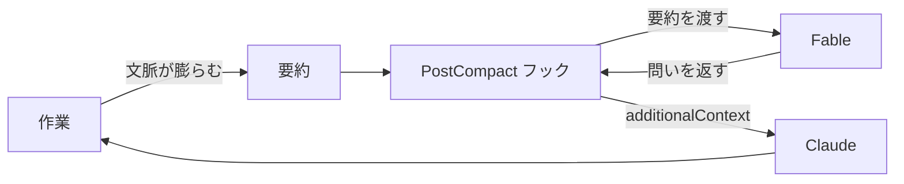

## はじめに

~~Twitter~~ X で話題になっていた記事を思い出しました。長く一人で作業を任せていると、目的とのズレに本人（Claude）は気づけません。そこに、別のモデルへ相談させるという着想が刺さったんですよね。

そこで、会話が要約された直後に Fable へ俯瞰の問いを 1 つ立てさせるフックを作りました。返ってきた問いは `additionalContext` として Claude の文脈に自動で入ります。

作り終えてから知ったのですが、これと同じことをする advisor ツールが Claude Code に**標準搭載されていました**[^1]。

という訳で、この記事は供養として書きます。advisor ツールを紹介したうえで、自作したフックも軽く解説して成仏させます🪦

## advisor とは

設定ファイルに 1 行書くだけで、メインモデルが要所で別モデルに相談するようになります。

```json
{ "advisorModel": "fable" }
```

発火の主導権は Claude 自身にあります。方針を固める前や、同じエラーで詰まったときなど、必要だと判断した場面で相談します。入力にはツール呼び出しと結果を含む会話全体が渡ります。

つまり、はじめに書いた「視座を戻す問いを Fable に立てさせる」という要求は、標準機能ですでに満たされていました。24 行、要らなかったんですよね。

## 再発明した Hook について

会話が要約された直後に発火するフックです。Claude Code には、そのタイミングで呼び出せる `PostCompact` というフックがちょうど用意されていました。

受け取った要約を Fable に読ませ、返ってきた問いを `additionalContext` として Claude の文脈へ渡します。流れを図にすると次のとおりです。



実装の全文はこの Pull Request にまとめてあります[^2]。

## どう使い分けるか

供養しつつ、使い分けの軸として整理します。

| 観点 | advisor ツール | 自作フック |
| :-- | :-- | :-- |
| 発火の主導権 | Claude が決める | 要約のたびに必ず |
| 入力 | 会話全体 | 要約のみ |
| 出力 | 従うべき指針 | 問い 1 つ |
| 動作環境 | Anthropic API のみ | `claude` が動けばどこでも |
| 実装量 | 0 行 | 24 行 + 設定 |

会話全体を読ませる advisor に対して、要約はすでに一段抽象化された情報です。断定はできませんが、俯瞰の問いを立てさせる用途には要約のほうが向いている可能性がある、という仮説だけ残しておきます。

## おわりに

正直、解説することはあまりないのですが、advisor ツールを知らずに 24 行を書いてしまった記録として残しておきたくて、この記事を書きました。

要約だけを渡して、発火のたびに必ず問いを立てさせたい場面は、advisor ツールでは代替できません。俯瞰の問いを自分で設計してみたい人には、まだ使い道があると思います。

Claude に何かを長く任せるときは、ぜひ advisor ツールから試してみてください！

[^1]: [advisor ツールで難しい判断をエスカレートする | Claude Code](https://code.claude.com/docs/ja/advisor)
[^2]: [feat: 会話が要約されたあと Fable に俯瞰を促す問いかけを求める | GitHub](https://github.com/yjn279/.claude/pull/84)
