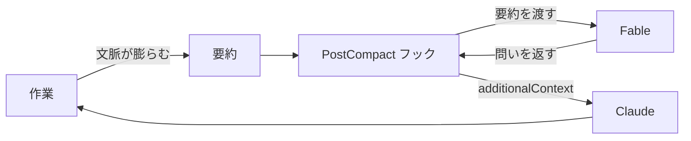

## はじめに

~~Twitter~~ X で話題だった記事を思い出し、会話要約直後に Fable へ俯瞰の問いを立てさせるフックを作りました。

作ってから、同じことをする advisor ツールが標準搭載と知り[^1]、供養として advisor を紹介し、自作フックも軽く解説して成仏させます🪦

## advisor とは

設定ファイルに 1 行書くだけで、メインモデルが要所で別モデルに相談するようになります。

```json
{ "advisorModel": "fable" }
```

発火の主導権は Claude 自身にあります。方針を固める前や、同じエラーで詰まったときなど、必要だと判断した場面で相談します。入力にはツール呼び出しと結果を含む会話全体が渡ります。

つまり、はじめに書いた「俯瞰の問いを Fable に立てさせる」という要求は、標準機能ですでに満たされていました。24 行、要らなかったんですよね。

## 再発明した Hook について

会話が要約された直後に発火するフックです。Claude Code には、そのタイミングで呼び出せる `PostCompact` というフックがちょうど用意されていました。

受け取った要約を Fable に読ませ、返ってきた問いを `additionalContext` として Claude の文脈へ渡します。流れを図にすると次のとおりです。



実装の全文はこの Pull Request にまとめてあります[^2]。

## どう使い分けるか？

供養しつつ、使い分けの軸として整理します。

| 観点 | advisor ツール | 自作フック |
| :-- | :-- | :-- |
| 発火 | Claude が決める | 要約のたびに必ず |
| 入力 | 会話全体 | 要約のみ |

基本は、公式機能である advisor ツールを使うのがよいと思います。強いて自作フックの利点を挙げるなら、渡す情報が要約だけなので、会話全体を渡す advisor ツールよりトークンの消費を抑えられる点です。

## おわりに

正直、解説することはあまりないのですが、事前に少し調べていれば防げた回り道でした。何かを作り込む前に、同じことをする機能がすでに無いか、まず探してみることをお勧めします。

Claude に何かを長く任せる場面があれば、ぜひ advisor ツールを試して、この失敗を成仏させてやってください！

[^1]: [advisor ツールで難しい判断をエスカレートする | Claude Code](https://code.claude.com/docs/ja/advisor)
[^2]: [feat: 会話が要約されたあと Fable に俯瞰を促す問いかけを求める | GitHub](https://github.com/yjn279/.claude/pull/84)
