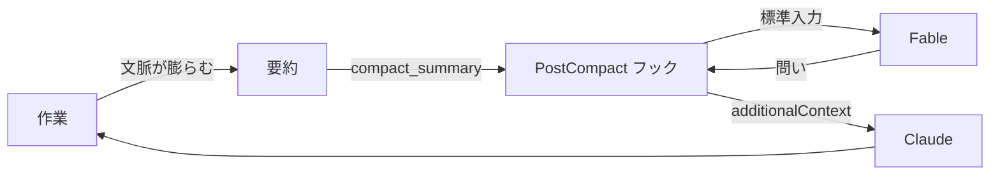

## はじめに

Claude Code に長時間の作業を任せていると、途中から目的とズレていることに本人（Claude）は気づけません。問題の立て方そのものが間違っていても、渦中にいる本人には見えないんですよね。外から一段引いた問いを投げて、視座を戻す仕組みが欲しくなります。

そこで、会話が要約された直後に Fable へ俯瞰の問いを 1 つ立てさせるフックを作りました。返ってきた問いは `additionalContext` として Claude の文脈に自動で入ります。

作り終えてから知ったのですが、これと同じことをする advisor ツールが Claude Code に **標準搭載されていました**。設定を 1 行書くだけで済みます。

という訳で、この記事は供養として書きます🪦

## advisor ツールとは

設定ファイルに 1 行書くだけで、メインモデルが要所で別モデルに相談するようになります。

```json
{ "advisorModel": "fable" }
```

`/advisor fable` でも `claude --advisor fable` でも同じ設定ができます。ドキュメントから、この記事で使う要点だけ抜き出します[^1]。

| 項目 | 内容 |
| :-- | :-- |
| 発火 | Claude 自身が決める。方針を固める前、同じエラーで詰まったとき、完了を宣言する前 |
| 入力 | ツール呼び出しと結果を含む会話全体 |
| 出力 | トランスクリプトの `Advising` 行。`Ctrl+O` で全文を開ける |
| モデル | Opus 4.7 以降がメインなら Fable を advisor にできる |
| 制約 | Anthropic API のみ。Bedrock・AWS・Google Cloud・Microsoft Foundry では使えない |
| 停止 | `/advisor off`、または `CLAUDE_CODE_DISABLE_ADVISOR_TOOL=1` |

つまり、はじめに書いた「視座を戻す問いを Fable に立てさせる」という要求は、標準機能ですでに満たされていました。24 行、要らなかったんですよね。

それでも、自作した仕様と使い分けには残す価値があると考えたので、以下に供養します。

## 中身は 24 行だけ

会話が要約された直後に発火する `PostCompact` に、`settings.json` でフックを登録します。

```json: settings.json
{
  "hooks": {
    "PostCompact": [
      {
        "hooks": [
          {
            "type": "command",
            "command": "\"$HOME/.claude/scripts/fable-advice/advise.mjs\"",
            "timeout": 120
          }
        ]
      }
    ]
  }
}
```

呼び出す実行ファイルの全文です。24 行しかありません。

```javascript: scripts/fable-advice/advise.mjs
#!/usr/bin/env node
// 会話が要約されたあと、その要約を Fable に読ませ、返ってきた問いかけを Claude へ渡す。
// 長く一人で作業するうちに下がった視座を、目的まで引き上げるために置く。
import { spawnSync } from "node:child_process";
import fs from "node:fs";

const ROLE = `You are an executive coach.
Based on the "summary", formulate a simple, abstract question that leads directly to the underlying objective. Output only the question.`;

// 要約は対象者自身の言葉で書かれている。要約であることを囲んで示すことで、
// 続きを書く側ではなく、外から問う側として読ませる。
const summary = JSON.parse(fs.readFileSync(0, "utf8")).compact_summary;
const asked = spawnSync(
  "claude",
  ["--print", "--safe-mode", "--no-session-persistence", "--model", "claude-fable-5", "--system-prompt", ROLE],
  { input: `<summary>\n${summary}\n</summary>`, encoding: "utf8" },
);

if (asked.status !== 0) {
  process.stderr.write(`Fable の呼び出しに失敗した: ${asked.error?.message ?? asked.stderr}\n`);
  process.exit(1);
}

process.stdout.write(JSON.stringify({ additionalContext: asked.stdout.trim() }));
```

処理は「要約を渡す」「返事を渡す」の 2 つだけで、分岐は呼び出しの失敗 1 つです。フォールバックは置かず、Fable の呼び出しが失敗した場合はそのまま表面化させています。`PostCompact` は作業を止めないフックなので、ここで失敗しても作業自体は続きます。

設置後の操作は不要です。会話が要約されるたびに自動で動き、返ってきた問いが `additionalContext` として Claude の文脈へ入ります。



実際の要約（13,737 文字）を渡して 3 回実行したときの出力です。

```plaintext
「この設計が固まった」と言えるのは、何が満たされたときですか？
そのルーブリックが本当に文体を捉えたと、何をもって確信しますか？
設計が「固まった」と言えるのは、何がどうなったときですか？
```

役割は英語で与えていますが、答えは要約の言語に合わせて返ってきます。所要は 14 秒前後でした。実装はこの Pull Request にまとめてあります[^2]。

## どう使い分けるか

供養しつつ、使い分けの軸として整理します。

| 観点 | advisor ツール | 自作フック |
| :-- | :-- | :-- |
| 発火の主導権 | Claude が決める | 要約のたびに必ず |
| 入力 | 会話全体 | 要約のみ |
| 出力 | 従うべき指針 | 問い 1 つ |
| 動作環境 | Anthropic API のみ | `claude` が動けばどこでも |
| 実装量 | 0 行 | 24 行 + 設定 |

会話全体を読ませる advisor に対して、要約はすでに一段抽象化された情報です。断定はできませんが、俯瞰の問いを立てさせる用途には要約のほうが向いている可能性がある、という仮説だけ残しておきます。

## おわりに

正直、解説することはあまりないのですが、advisor ツールを知らずに 24 行を書いてしまった記録として残しておきたくて、この記事を書きました。

要約だけを渡して、発火のたびに必ず問いを立てさせたい場面は、advisor ツールでは代替できません。俯瞰の問いを自分で設計してみたい人には、まだ使い道があると思います。

Claude に何かを長く任せるときは、ぜひ advisor ツールから試してみてください！

[^1]: [advisor ツールで難しい判断をエスカレートする | Claude Code](https://code.claude.com/docs/ja/advisor)
[^2]: [feat: 会話が要約されたあと Fable に俯瞰を促す問いかけを求める | GitHub](https://github.com/yjn279/.claude/pull/84)
