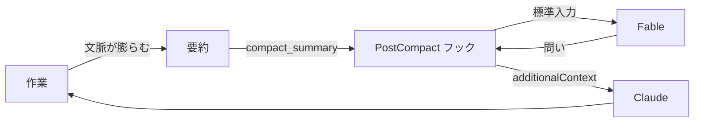

## はじめに

Claude Code に長時間の作業を任せていると、途中から目的とズレていることに本人（Claude）は気づけません。問題の立て方そのものが間違っていても、渦中にいる本人には見えないんですよね。外から一段引いた問いを投げて、視座を戻す仕組みが欲しくなります。

そこで、会話が要約された直後に Fable へ俯瞰の問いを1つ立てさせるフックを作りました。返ってきた問いは `additionalContext` として Claude の文脈に自動で入ります。

作り終えてから知ったのですが、これと同じことをする **advisor ツール** が Claude Code に標準搭載されていました。設定を1行書くだけで済みます。

という訳で、この記事は供養として書きます🪦

## advisor ツールとは

設定ファイルに1行書くだけで、メインモデルが要所で別モデルに相談するようになります。

```json
{ "advisorModel": "fable" }
```

`/advisor fable` でも `claude --advisor fable` でも同じ設定ができます。ドキュメントから、この記事で使う要点だけ抜き出します[^1]。

| 項目 | 内容 |
| :-- | :-- |
| 発火 | Claude 自身が決める。方針を固める前、同じエラーで詰まったとき、完了を宣言する前 |
| 入力 | ツール呼び出しと結果を含む会話全体 |
| 出力 | トランスクリプトの `Advising` 行。`Ctrl+O` で全文を開ける |
| モデル | Opus 4.7 以降がメインなら Fable を advisor にできる |
| 制約 | Anthropic API のみ。Bedrock・AWS・Google Cloud・Microsoft Foundry では使えない |
| 停止 | `/advisor off`、または `CLAUDE_CODE_DISABLE_ADVISOR_TOOL=1` |

つまり「一定間隔で Fable に助言させる」という、このあと書く要求は、標準機能ですでに満たされていました。24 行、要らなかったんですよね。

それでも、自作した経緯と実測と仕様には残す価値があると考えたので、以下に供養します。

## なぜ作ってしまったのか

出発点は「Claude が一人で長く作業を続けると視座が下がる」という課題でした[^2]。目的から離れていることにも、問題の立て方が間違っていることにも、作業中の本人は気づけません。外から俯瞰へ引き戻す問いかけが要る、というのが元の Issue です。

実装しない解決策を先に検討しました。

| 検討した案 | 却下した理由 |
| :-- | :-- |
| `/loop` | 会話そのものを占有し、作業と並行して問いかけを受け取れない |
| 既存のフック全般 | すべて会話の節目で発火し、時間で発火するものが無い |

どちらも時間で発火する仕組みを持たないため、採用を見送りました。この時点で advisor ツールの存在を知っていれば、ここで終わっていたはずです。

では、時間で発火できないなら何をきっかけにすればいいのか。最初は `PostToolBatch`（道具を使い終えた直後）に置き、30分の間隔を自前で管理し、会話記録の末尾80行を解析する形にしました。これを `PostCompact`（会話が要約された直後）へ移すことで、コードは大きく削れました。

| 項目 | PostToolBatch 版 | PostCompact 版 |
| :-- | :-- | :-- |
| 行数 | 74 行 | 24 行 |
| 間隔の管理 | 30分を自前で計測 | 不要（要約の発生に任せる） |
| 入力 | 会話記録の末尾80行を解析 | `compact_summary` をそのまま使う |

要約という出来事そのものが、3つの条件を同時に満たすからです。要約は作業が長く続いたときにしか起きないので、視座が下がっている頃合いと一致します。要約そのものが「ここまで何をしてきたか」なので、俯瞰の材料が揃っています。そして要約の直後は、Claude が仕切り直して作業を再開する瞬間です。

結果として、時間の管理・前回時刻の記録・会話記録の解析が、設計からまるごと消えた訳です。

## ドキュメントと実際が逆だった

フックのドキュメントには「要約の全文は JSON 入力に渡されない。`transcript_path` のファイルを読む必要がある」と書かれています[^3]。

**実測すると、逆でした。**

検証方法はシンプルです。標準入力をそのまま書き出すフックを `--settings` で仕込み、既存セッションを `--fork-session` で複製して `/compact` を実行します。

```shell
claude --resume <session-id> --fork-session --settings probe.json -p "/compact"
```

得られた事実は2つです。要約は `compact_summary` として標準入力にそのまま入っていました。そして、その時点で `transcript_path` のファイルはまだ存在しませんでした（`ENOENT`）。

要するに、ドキュメントどおりに `transcript_path` を読む実装は動かず、かつ読む必要も最初からありません。実際に渡ってくるキーは `session_id` `transcript_path` `cwd` `prompt_id` `hook_event_name` `trigger` `compact_summary` の7つでした。

## 中身は 24 行だけ

`settings.json` にフックを登録します。

```json
{
  "hooks": {
    "PostCompact": [
      {
        "hooks": [
          {
            "type": "command",
            "command": "\"$HOME/.claude/scripts/fable-advice/advise.mjs\"",
            "timeout": 120
          }
        ]
      }
    ]
  }
}
```

呼び出す実行ファイルの全文です。24 行しかありません。

```javascript:scripts/fable-advice/advise.mjs
#!/usr/bin/env node
import { spawnSync } from "node:child_process";
import fs from "node:fs";

const ROLE = `You are an executive coach.
Based on the "summary", formulate a simple, abstract question that leads directly to the underlying objective. Output only the question.`;

const summary = JSON.parse(fs.readFileSync(0, "utf8")).compact_summary;
const asked = spawnSync(
  "claude",
  ["--print", "--safe-mode", "--no-session-persistence", "--model", "claude-fable-5", "--system-prompt", ROLE],
  { input: `<summary>\n${summary}\n</summary>`, encoding: "utf8" },
);

if (asked.status !== 0) {
  process.stderr.write(`Fable の呼び出しに失敗した: ${asked.error?.message ?? asked.stderr}\n`);
  process.exit(1);
}

process.stdout.write(JSON.stringify({ additionalContext: asked.stdout.trim() }));
```

処理は「要約を渡す」「返事を渡す」の2つだけで、分岐は呼び出しの失敗1つです。フォールバックは置かず、失敗はそのまま表面化させています。`PostCompact` は作業を止めないフックなので、ここで失敗しても作業自体は続きます。

設置後の操作は不要です。会話が要約されるたびに自動で動き、返ってきた問いが `additionalContext` として Claude の文脈へ入ります。



実際の要約（13,737 文字）を渡したときの出力です。

```plaintext
「この設計が固まった」と言えるのは、何が満たされたときですか？
そのルーブリックが本当に文体を捉えたと、何をもって確信しますか？
設計が「固まった」と言えるのは、何がどうなったときですか？
```

役割は英語で与えていますが、答えは要約の言語に合わせて返ってきます。所要は14 秒前後でした。実装はこの Pull Request にまとめてあります[^4]。

## 3回ずつ試してみる

同一の要約を使い、3回ずつ試した数値が残っています。タグ・引数・プロンプトの順に見ていきます。

### タグで囲む

要約は Claude 自身の一人称で書かれた引き継ぎ文書で、末尾には「次にこれを報告せよ」まで書かれています。素で渡すと、Fable は問う側ではなく作業を引き継ぐ側としてこれを読み、問いを返しません。

| 囲み | 問いが出なかった回 | 前置きが付いた回 |
| :-- | :-- | :-- |
| なし | 2 / 3 | 3 / 3 |
| `<summary>` | 0 / 3 | 3 / 3 |
| `<coachee_summary>` | 1 / 3 | 3 / 3 |
| `<coachee_work_summary>` | 0 / 3 | 1 / 3 |

タグを具体的にするほど、語り手側に寄りにくくなります。最終的にはシンプルさを取って `<summary>` を採用しました。

### 引数を外す

| 引数 | 外した場合 |
| :-- | :-- |
| `--safe-mode` | 8.6 秒 → 15.1 秒。CPU 時間は 0.66 秒 → 6.14 秒。周りの設定を読んだうえでの答えになる |
| `--no-session-persistence` | セッションが1つ増える（1581 → 1582）。要約のたびに溜まる |

### 言い回しを直す

英語として自然に直すと、かえって出力が悪化した例です。

| プロンプト | 結果 |
| :-- | :-- |
| `Based on the "summary", formulate a simple, abstract question...` | 3/3 で日本語1問（23〜32 文字） |
| `the "summary"` を `the <summary>` に直す | 3/3 で1問。ただし1回が英語 |
| `gets at` `high-level` など自然な言い回しに直す | 3/3 で英語 137〜162 文字 |

引用符は scare quotes に読めるので英語としては不自然ですが、外すと入力言語に合わせる力が落ちました。自然さと出力品質が一致しない例です。

## どう使い分けるか

供養しつつ、使い分けの軸として整理します。

| 観点 | advisor ツール | 自作フック |
| :-- | :-- | :-- |
| 発火の主導権 | Claude が決める | 要約のたびに必ず |
| 入力 | 会話全体 | 要約のみ |
| 出力 | 従うべき指針 | 問い1つ |
| 動作環境 | Anthropic API のみ | `claude` が動けばどこでも |
| 実装量 | 0 行 | 24 行 + 設定 |

会話全体を読ませる advisor に対して、要約はすでに一段抽象化された情報です。断定はできませんが、俯瞰の問いを立てさせる用途には要約のほうが向いている可能性がある、という仮説だけ残しておきます。

## おわりに

正直、解説することはあまりないのですが、advisor ツールを知らずに24 行を書いてしまった記録として残しておきたくて、この記事を書きました。

ドキュメントに書かれていない `PostCompact` の実挙動や、タグ・引数・プロンプトの効き目を3回ずつ試した数値は、advisor ツールが無くても手元に残ります。俯瞰の問いを自分で設計してみたい人には、まだ使い道があると思います。

Claude に何かを長く任せるときは、ぜひ advisor ツールから試してみてください！

[^1]: [advisor ツールで難しい判断をエスカレートする | Claude Code](https://code.claude.com/docs/ja/advisor)
[^2]: [一定間隔でFableでアドバイスを実施するhooksの作成 | GitHub](https://github.com/yjn279/.claude/issues/83)
[^3]: [Hooks リファレンス | Claude Code](https://code.claude.com/docs/ja/hooks)
[^4]: [feat: 会話が要約されたあと Fable に俯瞰を促す問いかけを求める | GitHub](https://github.com/yjn279/.claude/pull/84)
